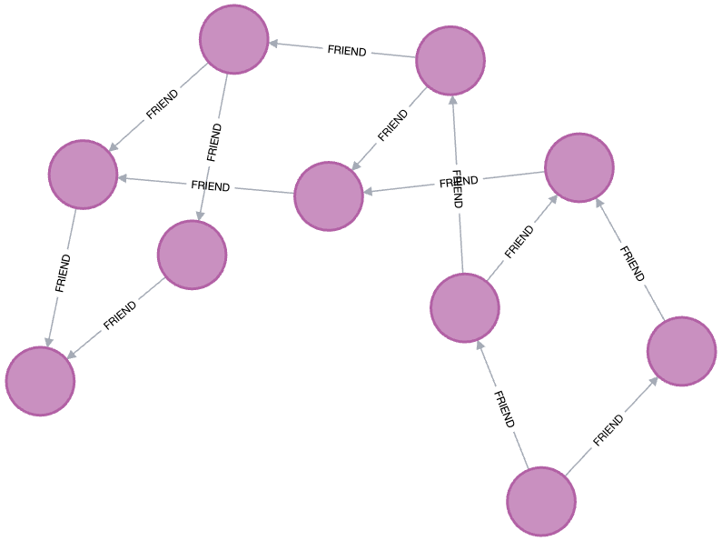

# Couchsurfing Challenge

This project is an API built with NestJS, TypeScript, and Neo4j.
It provides a basic social network functionality where users can manage their profiles and relationships with other users.

## Development process

initial requirements:
```text
Create a basic REST API that runs as a docker container and does the following:

Has a resource that is a user
User should have an attribute that describes its relationship to other uses (think friends)
Seeds user data (static list or DB whichever is preferred)
Serves CRUD endpoints for the user resource
Has an additional endpoint that finds the relationship distance from one user to another user (this user is a 2nd, 3rd, distance relationship)
```

## Architectural Decisions
- GraphQL over REST
  - Chosen for its flexibility in data retrieval, allowing clients to specify exactly what they need
- Neo4j Graph Database
  - Chosen for its ability to represent relationships between profiles in a more natural way
  - Cypher query language is well suited for querying graph data
- Profile entity over User entity
  - Chosen to avoid confusion with authentication and authorization
  - The focus is on the profile data, not the user data
  
## Features

- CRUD operations for user profiles.
- Manage friendships between users.
- Calculate relationship distance between two users.

## Getting Started

These instructions will get you a copy of the project up and running on your local machine for development and testing purposes.

### Prerequisites

- Node.js
- Docker
- Docker Compose

### Installing

Clone the repository:

```bash
git clone https://github.com/LeoUrzua/social-media-graphs
```

Build and run the project using Docker compose:

```bash
docker-compose up --build
```


The API should now be accessible at http://localhost:3000/.


## Running the tests

To run the tests, execute the following command:

```bash
 npm run test
```


## GraphQL Schema

```graphql

type Profile {
  id: ID!
  firstName: String!
  lastName: String!
  bio: String
  friends: [Profile]
}

type Query {
  profiles: [Profile!]!
  profile(id: String!): Profile
  relationshipDistance(profileId: String!, targetProfileId: String!): Int!
}

type Mutation {
  createProfile(firstName: String!, lastName: String!, bio: String): Profile!
  removeProfile(id: String!): Boolean!
  updateProfile(id: String!, input: UpdateProfileInput!): Profile!
  addFriend(profileId: String!, friendId: String!): Profile!
  removeFriend(profileId: String!, friendId: String!): Profile!
}

input UpdateProfileInput {
  firstName: String
  lastName: String
  bio: String
}
```

## Graphical representation

Note: the graph is not updated in real-time. It is a representation of the initial data. The initial data is seeded when the application starts.



## Usage

After running the project, you can use the GraphQL playground to interact with the API.
http://localhost:3000/

The database can be accessed at http://localhost:7474/browser/


### Examples

Query profiles:
```graphql
{
  profiles{
		id
    firstName
    friends{
      id
      firstName
    }
  }
}
```


```graphql
{
  profile(id: "1"){
    id
    firstName
    friends{
      id
      firstName
    }
  }
}
```


Create a profile:
```graphql
mutation {
  createProfile(firstName: "tom", lastName: "Cruise"){
    id
    firstName
  }
}
```


Add a friend:
```graphql
mutation {
  addFriend(
    profileId: "",
    friendId: ""
  ){
    lastName
    friends{
      firstName
    }
  }
}
```

remove a friend:
```graphql
mutation {
  removeFriend(
    profileId: "",
    friendId: ""){
    lastName
  }
}
```

relationship distance:
```graphql
{
    relationshipDistance(
        profileId: "10"
        targetProfileId: "1"
    )
}
```

remove a profile:
```graphql
mutation {
  removeProfile(id: "1")
}
```

update a profile:
```graphql
mutation {
	updateProfile(id: "1", input: {
    firstName: "tron",
    lastName: "legacy"
  }){
    id
    firstName
    lastName
  }
}
```


## Notes

I would like to add more features to the API, such as:
- Authentication
- Authorization
- Endpoints to manage:
  - Friend requests - (instead of adding friends directly)
    - Send friend request
    - Accept friend request
    - Reject friend request
    - Cancel friend request

## Challenges
  - Learning NestJS.

  - Learning Neo4j and Cypher query language.

  - Setting up the Neo4j database in a Docker container.
